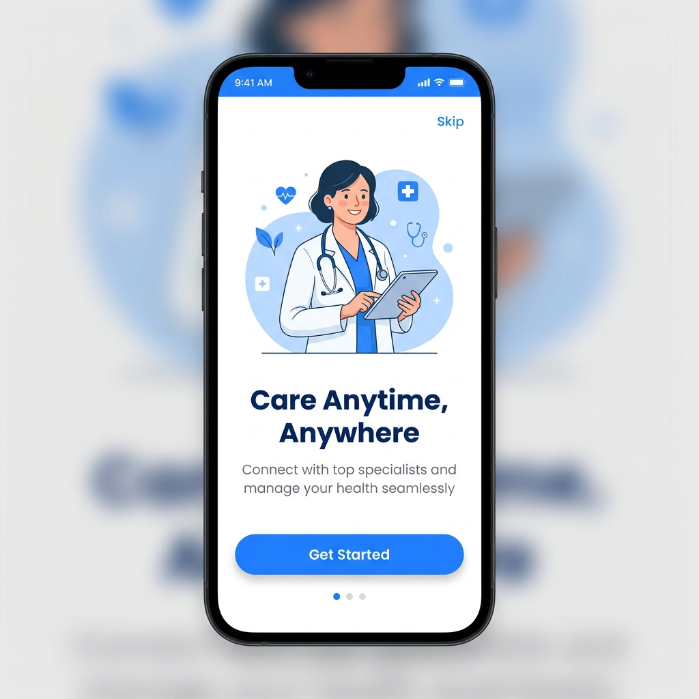
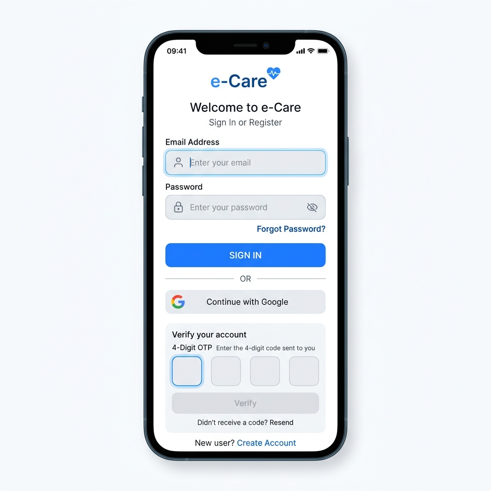
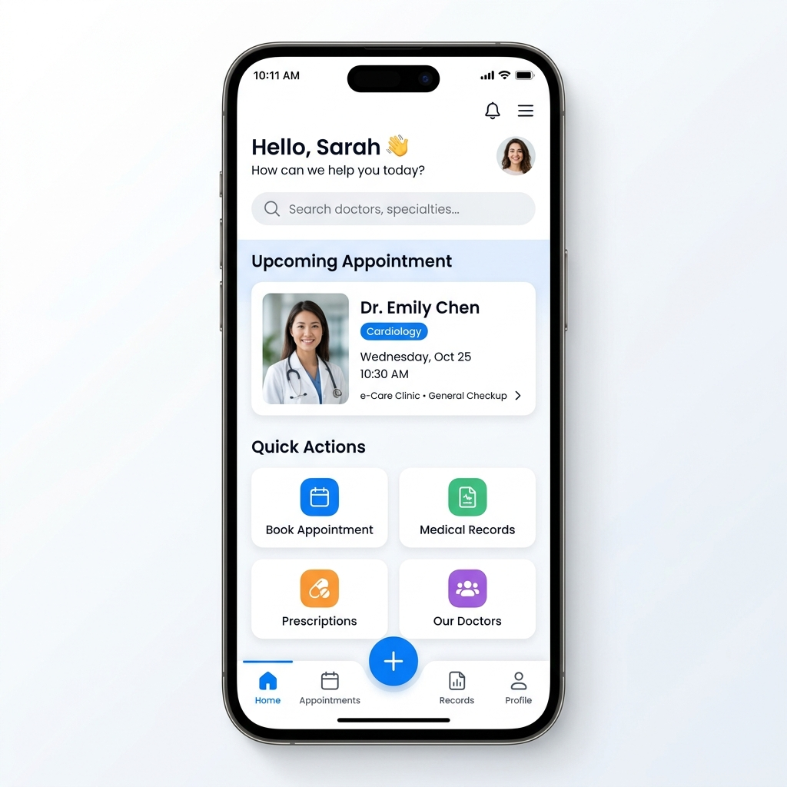
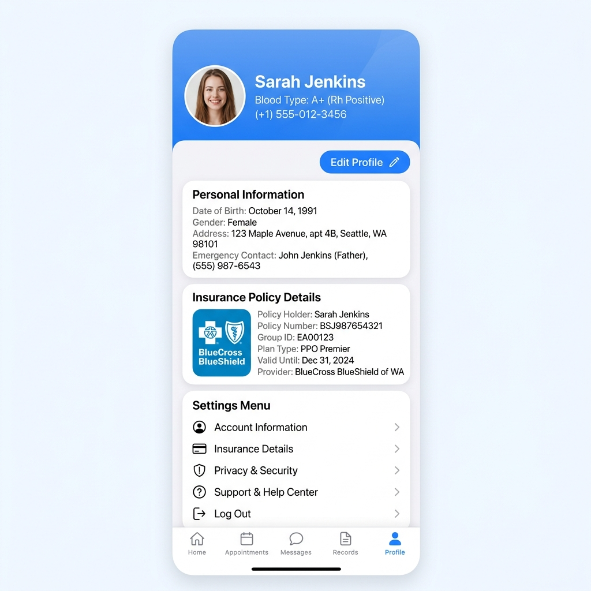

<div align="center">

  # 🏥 e-Care Mobile Platform
  **Modern Healthcare & Patient Management Mobile Application built with Flutter**

  [](https://flutter.dev)
  [](https://dart.dev)
  [](#-architecture--design-patterns)
  [](https://pub.dev/packages/flutter_bloc)

</div>

---

## 📌 Overview

**e-Care** is a modern, high-performance cross-platform mobile application designed to simplify medical care access, patient onboarding, appointment scheduling, health insurance tracking, and patient account management.

Built using **Flutter**, **Clean Architecture**, **BLoC/Cubit state management**, and **Retrofit/Dio networking**, e-Care delivers an intuitive, secure, and responsive user experience for patients to connect with healthcare providers and manage their health profiles on iOS and Android.

---

## 📸 Screenshots Showcase

<div align="center">

| 📱 Onboarding & Welcome | 🔐 Auth & Verification |
| :---: | :---: |
|  |  |

| 🏥 Home Dashboard | 👤 Patient Profile & Insurance |
| :---: | :---: |
|  |  |

</div>

---

## ✨ Key Features

### 🚀 Onboarding & User Experience
* **Visual Walkthrough**: Interactive onboarding flow guiding users through e-Care core features.
* **Get Started Flow**: Smooth transition from onboarding to authentication.

### 🔒 Authentication & Account Security
* **Multi-Step Authentication**: Secure Sign-In and User Registration options.
* **OTP Verification**: 4-digit OTP code verification for account registration and password resets.
* **Password Recovery**: Complete reset password workflow (Forgot Password $\rightarrow$ Verify OTP $\rightarrow$ Set New Password).

### 👤 Patient Profile & Insurance Management
* **Comprehensive Patient Profile**: Create, view, and update patient demographics, emergency contacts, and personal health metrics.
* **Insurance Management**: Detailed insurance policy tracking, provider details, and coverage info.
* **Account Settings**: Customizable app preferences and security controls.

### 🗓️ Clinic & Dashboard Navigation
* **Centralized Dashboard**: Quick action menu, upcoming doctor appointments, and medical summary.
* **Interactive Navigation**: Bottom navigation bar with smooth screen switching and central Quick Action Floating Action Button (FAB).

---

## 🛠️ Tech Stack & Dependencies

| Category | Technology / Package | Purpose |
| :--- | :--- | :--- |
| **Framework** | Flutter (SDK ^3.7.2) | Cross-platform mobile development |
| **Language** | Dart | Strong-typed object-oriented programming |
| **State Management** | `flutter_bloc` (^9.1.1) | Predictable Cubit state management |
| **Dependency Injection** | `get_it` (^8.2.0) | Service locator pattern |
| **Networking** | `dio` (^5.9.0) & `retrofit` (^4.6.0) | REST API client & HTTP interceptors |
| **Code Generation** | `build_runner` & `retrofit_generator` | Automated serialization & API binding |
| **Storage** | `flutter_secure_storage` & `shared_preferences` | Encrypted token storage & local app preferences |
| **UI Components** | `flutter_screenutil` (^5.9.3) | Pixel-perfect responsive screen scaling |
| **Image Caching** | `cached_network_image` (^3.4.1) | Optimized image downloading & caching |
| **Typography** | Urbanist Font Family | Modern typography hierarchy (Weights 100 - 900) |

---

## 🏗️ Architecture & Design Patterns

The project enforces **Clean Architecture** principles structured by feature (Feature-First pattern):

```text
lib/
├── core/
│   ├── constants/       # Asset paths, string constants, app defaults
│   ├── errors/          # API error handlers & exceptions
│   ├── networking/      # Dio factory, Retrofit services, API constants
│   ├── routing/         # AppRouter & Routes definitions
│   ├── theme/           # AppColors, typography, & Material theme
│   └── utils/           # Service locator (get_it DI), helpers
│
└── features/
    ├── authentication/  # Auth data, API models, Cubit & UI screens
    ├── home/            # Dashboard UI, root screen & navigation bar
    ├── onboarding/      # Welcome flow & Get Started screens
    ├── profile/         # Patient profile model, Cubit, & profile screens
    └── settings/        # App configuration & preferences screens
```

Each feature follows a 3-layer architecture:
1. **Data Layer**: API models (`json_annotation`), repository implementations, and data sources.
2. **Domain Layer**: Business models, contracts, and use cases.
3. **Presentation Layer**: Cubit state management (`flutter_bloc`), screen widgets, and form validation logic.

---

## 🚀 Getting Started

### Prerequisites

Ensure you have the following installed on your machine:
* [Flutter SDK](https://docs.flutter.dev/get-started/install) (`^3.7.2` or later)
* [Dart SDK](https://dart.dev/get-dart)
* Android Studio / VS Code with Flutter extensions
* Xcode (for iOS build on macOS)

### Installation & Setup

1. **Clone the Repository**:
   ```bash
   git clone https://github.com/mumenabdelkader/e-care.git
   cd e-care
   ```

2. **Install Dependencies**:
   ```bash
   flutter pub get
   ```

3. **Run Code Generation** (Retrofit & JSON Serializer):
   ```bash
   dart run build_runner build --delete-conflicting-outputs
   ```

4. **Launch the Application**:
   ```bash
   # Run on an available emulator or connected device
   flutter run
   ```

---

## 🎨 Design Tokens & Palette

* **Primary Blue**: `#257CFF`
* **Light Blue Accent**: `#59C3FF`
* **Success Green**: `#48BD69`
* **Warning Yellow**: `#FFC046`
* **Error Red**: `#ED2828`
* **Dark Text / Background**: `#1D1E25`
* **Soft Grey Surface**: `#F8F8FB` / `#E9ECF2`

---

## 🤝 Contributing

Contributions are welcome! Please follow these steps:
1. Fork the project repository.
2. Create your feature branch (`git checkout -b feature/AmazingFeature`).
3. Commit your changes (`git commit -m 'Add some AmazingFeature'`).
4. Push to the branch (`git push origin feature/AmazingFeature`).
5. Open a Pull Request.

---

## 📄 License

This project is licensed under the MIT License - see the [LICENSE](LICENSE) file for details.
